# 🧶 Cozy Crochet Hub — Full Stack E-Commerce Website

A full-stack handmade crochet e-commerce web application built using Java Servlets, JSP, and Apache Derby. The platform supports complete customer shopping flows and a fully functional admin dashboard — built as a major project during my BCA degree.

---

## 🖥️ Preview

### Homepage
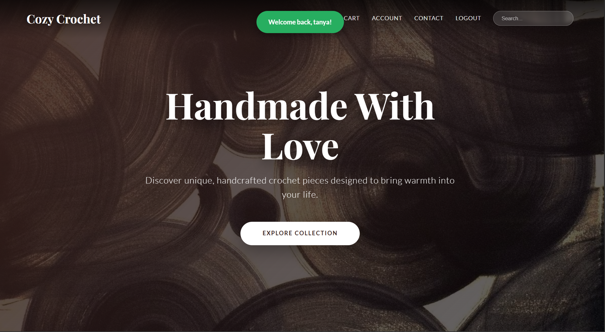.

### Our Collection
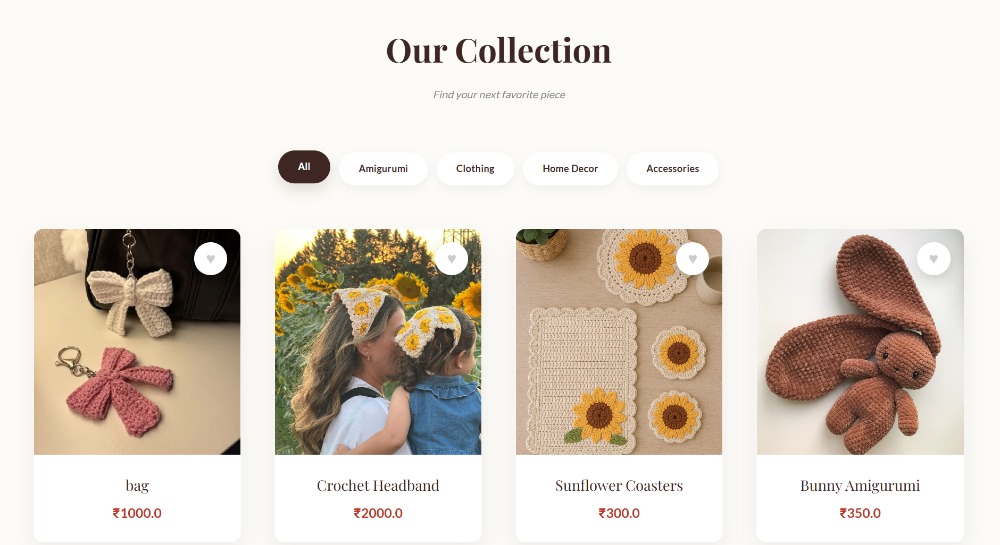

### My Wishlist


### Shopping Cart
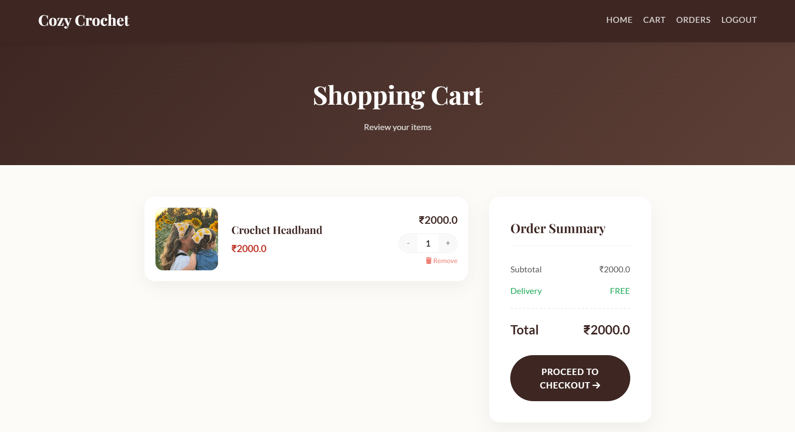

### Checkout — Shipping & Payment


### Payment Methods (UPI, Card, COD)
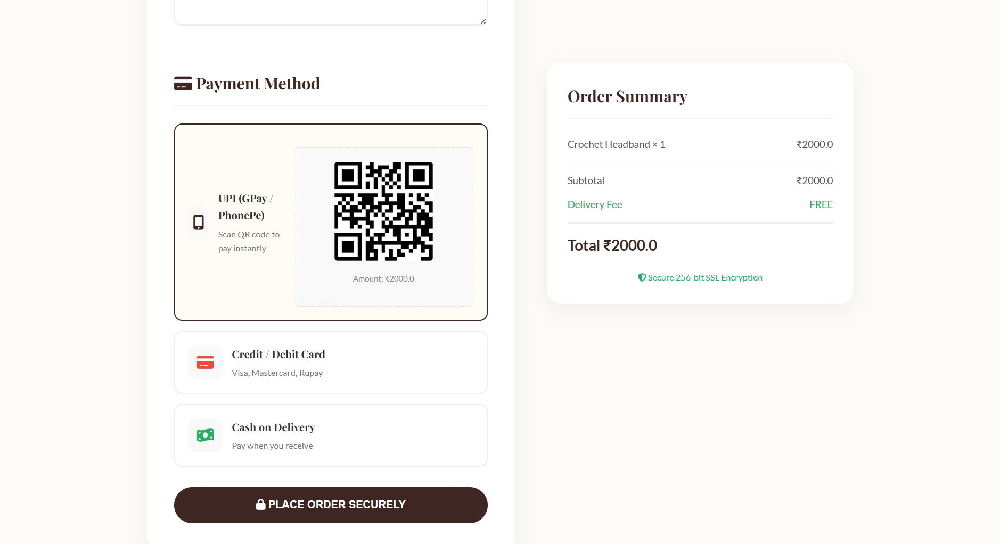

### Contact Page
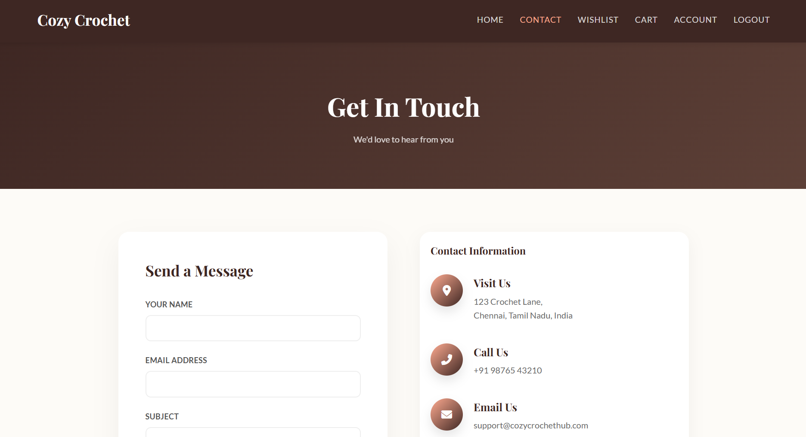

### My Account — Profile Settings
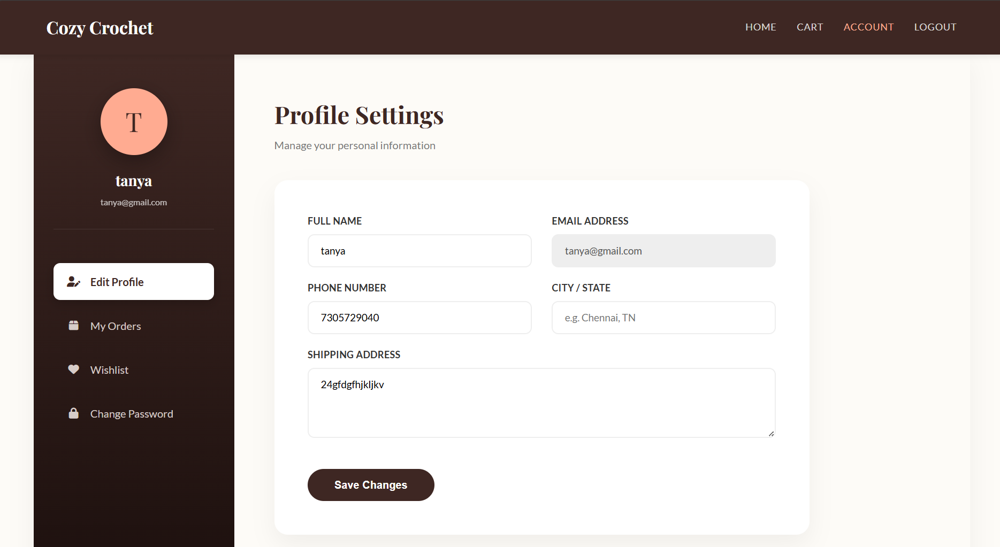

### Login Page
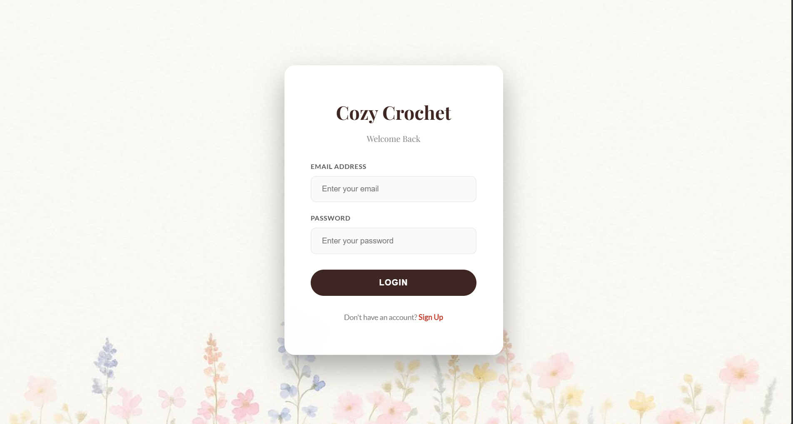

### Admin Dashboard Overview


### Admin Low Stock Alert
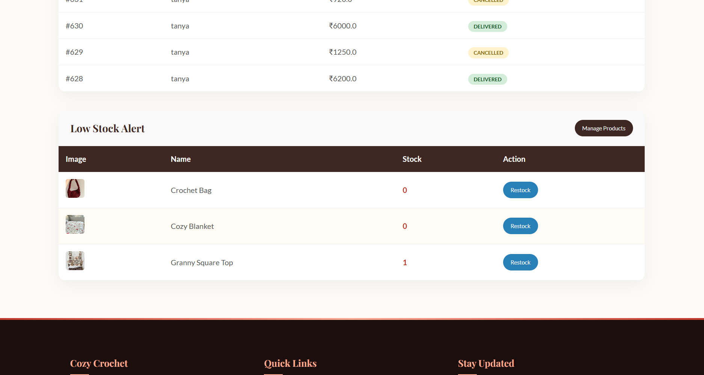

### Admin Manage Products
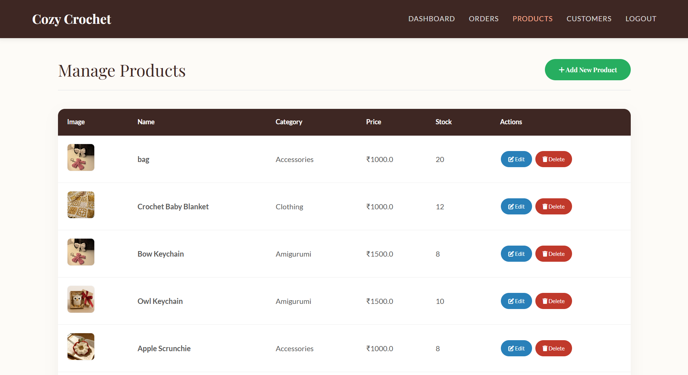

### Admin Manage Orders
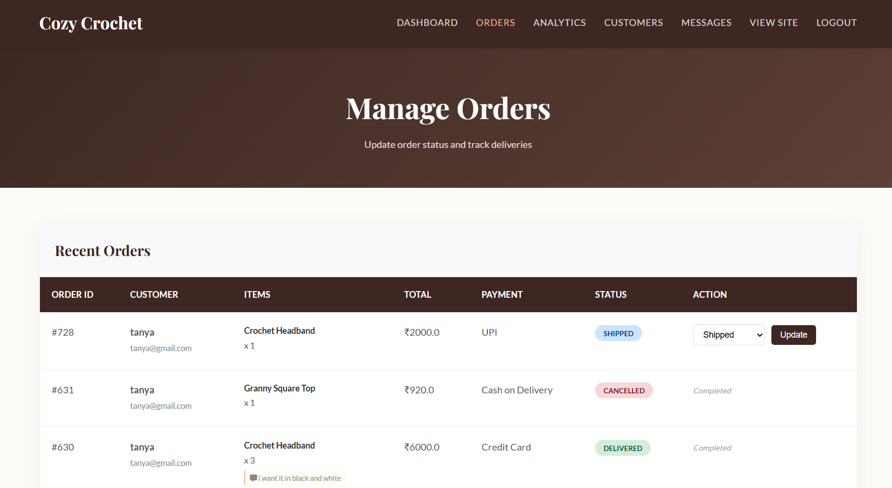

### Admin Sales Analytics
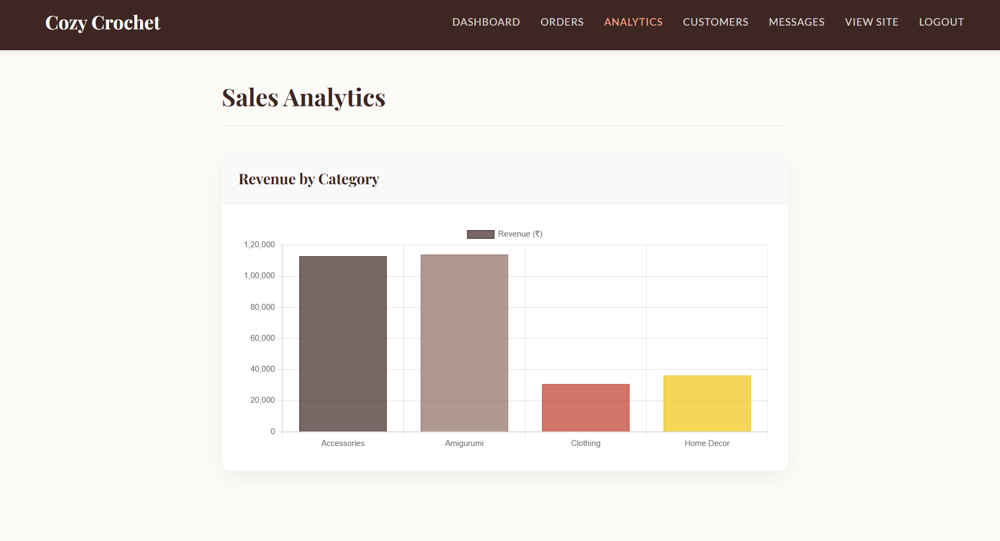

### Admin Customer Management
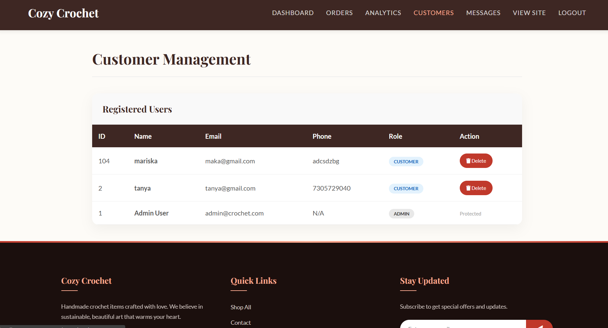

### Admin Contact Messages
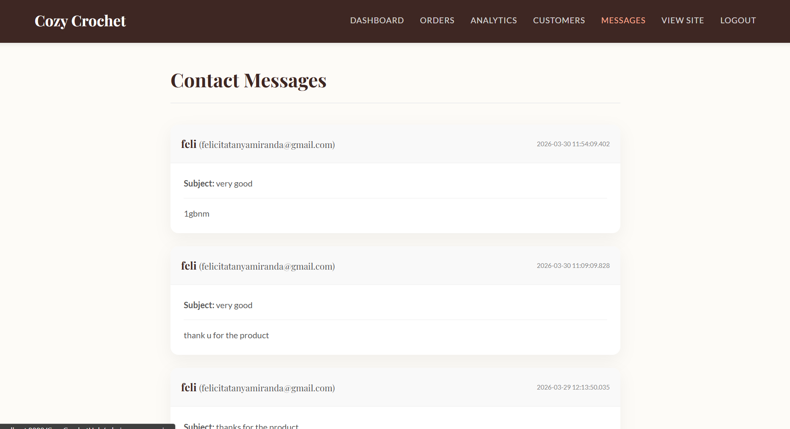

---

## ✨ Features

### 👤 Customer Side
- **User Registration & Login** — email and password authentication with server-side validation (name must be letters only, password minimum 4 characters, duplicate email check)
- **Shop Page** — browse all crochet products in a grid with category filters (All, Amigurumi, Clothing, Home Decor, Accessories) and a live search bar
- **Wishlist** — add products to wishlist with heart button, view saved favorites, move items directly to cart, stock badge displayed on each card
- **Shopping Cart** — add items with quantity control (+/-), remove items, order summary with subtotal and delivery fee calculation, proceed to checkout with stock validation
- **Checkout** — shipping address form (full name, phone, address), multiple payment options: UPI/GPay/PhonePe with QR code, Credit/Debit Card, Cash on Delivery
- **Order Placement** — places order with stock deduction, supports delivery fee and COD surcharge logic, redirects to confirmation page
- **My Orders** — view all past orders with status tracking, cancel pending orders (with automatic stock restore and refund message for online payments)
- **Product Reviews** — submit star rating and comment; only users with a delivered order for that product can review
- **My Account** — sidebar with Edit Profile, My Orders, Wishlist and Change Password; update name, phone and shipping address with validation
- **Contact Form** — sends message (name, email, subject, message) saved directly to the database

### 🔐 Admin Dashboard
- **Dashboard Overview** — stat cards showing total products (24), total orders (57) and total revenue (₹2,21,380), recent orders table with colour-coded status badges (Shipped, Delivered, Cancelled)
- **Low Stock Alert** — highlights products with stock at 0 or 1 with a Restock button directly on the dashboard
- **Product Management** — full product table with image, name, category, price, stock and Edit/Delete buttons; Add New Product form
- **Order Management** — full order table with order ID, customer email, items with customization notes, total, payment method, colour-coded status badge and dropdown to update status
- **Sales Analytics** — revenue by category bar chart (Accessories, Amigurumi, Clothing, Home Decor)
- **Customer Management** — registered users table with ID, name, email, phone, role badge (CUSTOMER/ADMIN); admin account marked as Protected and cannot be deleted
- **Contact Messages** — all messages displayed with sender name, email, subject, message body and timestamp
- **View Site** — admin can switch directly to the customer-facing shop from the navbar

### ⚙️ Technical Highlights
- **Session Management** — cart and user stored in HTTP session, cart synced to database on every change
- **Database Transactions** — order placement, cancellation and user deletion use `setAutoCommit(false)` with rollback on failure
- **Stock Validation** — checked at add-to-cart, cart page, checkout and order placement stages
- **Server-side Validation** — name (letters only), phone (10 digits), password length, duplicate email
- **Protected Pages** — `checkLogin()` session check on flowers and cart pages, role-based routing on login

---

## 🛠️ Built With


---

## 📁 Project Structure

```
CozyCrochetHub/
│
├── src/
│   └── java/com/cozycrochet/
│       ├── db/
│       │   └── DBConnection.java          # Apache Derby database connection
│       ├── models/
│       │   ├── User.java                  # User model (id, name, email, role, phone, address)
│       │   └── CartItem.java              # Cart item model (id, name, price, qty, customization, image)
│       └── servlets/
│           ├── LoginServlet.java          # Login + cart load from DB
│           ├── Registerservlet.java       # Registration with validation
│           ├── CartServlet.java           # Add, remove, update, checkout validation
│           ├── OrderServlet.java          # Place order, stock deduct, transaction
│           ├── CancelOrdersServlet.java   # Cancel order, restore stock, refund message
│           ├── WishlistServlet.java       # Add, remove, move to cart
│           ├── ReviewServlet.java         # Submit review (delivered orders only)
│           ├── ContactServlet.java        # Save contact message to DB
│           ├── UpdateProfileServlet.java  # Update name, phone, address
│           ├── ChangePasswordServlet.java # Verify current + update password
│           ├── AddProductServlet.java     # Admin: add new product
│           ├── ProductServlet.java        # Admin: update product
│           ├── DeleteProductServlet.java  # Admin: delete product
│           ├── DeleteUserServlet.java     # Admin: delete user (cascade transaction)
│           └── UpdateStatusServlet.java   # Admin: update order status
│
└── web/
    ├── shop.jsp                # Homepage + product grid with filters
    ├── cart.jsp                # Shopping cart with order summary
    ├── wishlist.jsp            # Saved favorites
    ├── checkout.jsp            # Shipping address + payment method
    ├── confirmation.jsp        # Order placed confirmation
    ├── my_orders.jsp           # Customer order history
    ├── my_account.jsp          # Profile settings sidebar
    ├── change_password.jsp     # Change password form
    ├── review_product.jsp      # Product review form
    ├── contact.jsp             # Contact form + business info
    ├── login.jsp               # Login page
    ├── register.jsp            # Registration page
    ├── logout.jsp              # Session invalidation
    ├── admin.jsp               # Admin dashboard
    ├── admin_products.jsp      # Admin product list
    ├── admin_orders.jsp        # Admin order management
    ├── admin_users.jsp         # Admin user management
    ├── admin_messages.jsp      # Admin contact messages
    ├── admin_analytics.jsp     # Admin analytics
    ├── add_product.jsp         # Add product form
    ├── edit_product.jsp        # Edit product form
    ├── footer.jsp              # Shared footer component
    └── style.css               # All page styles
```

---

## 🗄️ Database Tables

| Table | Description |
|---|---|
| `Users` | Stores customer and admin accounts with roles |
| `Products` | Product catalogue with name, price, stock, category |
| `Cart` | Persistent cart synced per user |
| `Wishlist` | Saved products per user |
| `Orders` | Order records with status, payment method, address |
| `Order_Items` | Individual items per order with quantity and price |
| `Reviews` | Product reviews tied to delivered orders |
| `ContactMessages` | Messages submitted via contact form |

---

## 🚀 How to Run Locally

1. Install **NetBeans IDE** and **Apache Tomcat**
2. Install and start **Apache Derby** database
3. Create a database named `CrochetStoreDB` with user `crochet_admin`
4. Run the SQL scripts to create all tables
5. Open the project in NetBeans
6. Right-click the project → **Run**
7. Visit `http://localhost:8080/CozyCrochetHub/shop.jsp`

---

## 🎓 About This Project

Built as a major project during my BCA degree to demonstrate full-stack Java web development. This project covers MVC architecture with Java Servlets and JSP, relational database design, session and transaction management, role-based access control and a fully designed responsive UI.

---

## 👩‍💻 Author

**Felicita Tanya Miranda**
[](https://www.linkedin.com/in/felicita-tanya)
[](mailto:felicitatanyamiranda@gmail.com)
